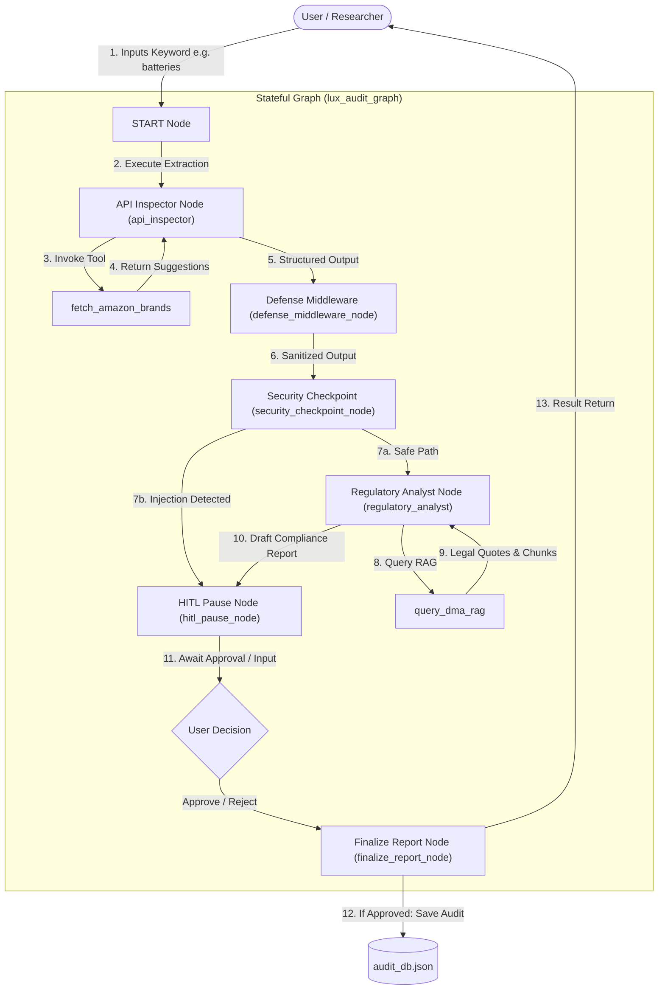

# LUX (Legal Uncovering, eXplainable) Agent

**Project Overview:**

This is the capstone project for the course "5-Day AI Agents: Intensive Vibe Coding Course With Google" on Kaggle. Its purpose is to showcase what I have learned by designing and implementing a practical modern AI agent system: from Vibecoding to Agentic Engineering and Loop Engineering.

### **Problem Definition**

Investigating algorithmic platforms requires combining brittle, technically demanding data extraction with complex legal analysis. Traditional HTML scraping is fragile, and mapping massive datasets to evolving regulations like the Digital Markets Act (DMA) creates a severe bottleneck for researchers and auditors. There is a critical need for an automated workflow that reliably extracts data and drafts compliance reviews, while ensuring human experts retain ultimate sign-off authority.

### **Concept Summary**

**LUX (Legal Uncovering, eXplainable)** is a scoped, multi-agent system orchestrated by Google ADK. It automates the extraction of algorithmic data using highly reliable undocumented APIs, cross-references the findings against regulatory frameworks via RAG, and stages an evidence-backed compliance report for mandatory human review and approval via a web dashboard.

**Primary Users:** Academic researchers, investigative journalists, policy analysts, and NGO advocates.

**Case Study**  
Auditing Amazon for self-preferencing (DMA Article 6). We will utilize the undocumented JSON API powering Amazon's "Our brands" filter to reliably bypass HTML brittleness and identify whether in-house brands are artificially boosted in search rankings.

**References** 

https://inspectelement.org/

---

## **Technical Architecture and Key Features**

### **Agent Catalog**

1. **The API Inspector (Autonomous):** Executes the technical extraction. Queries the Amazon search suggestions API using a sandboxed Python script, parses the JSON, and structures the output.  
2. **The Regulatory Analyst (Advisory):** Receives the structured data, queries the RAG knowledge base for DMA gatekeeper rules, and drafts a preliminary compliance assessment.

### **Skill Library**

* **fetch_amazon_brands (MCP Tool):** Queries Amazon's search suggestion API to extract structured suggestions and classify brand types (private-label vs. third-party).
* **query_dma_rag (Vertex Search Tool):** Performs semantic search queries against a Vertex AI Search endpoint containing indexed regulatory texts (such as the DMA) to locate legal definitions and rules.

### **Architecture**

* **Trigger:** User inputs a keyword (e.g., "batteries") via the UI or playground.
* **Agent Runtime:** Vertex AI Agent Engine.  
* **Orchestration:** Google ADK utilizing a stateful Graph API to manage the workflow and HITL pause state.  
* **Sandbox:** Model Context Protocol (MCP) server for secure Python execution.  
* **Knowledge:** Vertex AI Search (RAG) loaded with DMA documentation.

### **Architectural Data Flow**

The diagram below shows the event-driven topology of the LUX workflow, illustrating the secure pipeline from automated ingestion to the management approval loop:



### **Tech Stack**

* **Workflow Engine:** Google ADK (Stateful graph API).  
* **Runtime:** Vertex AI Agent Engine (Gemini 1.5 Pro / Gemini 2.0 Flash).  
* **Tooling Sandbox:** Cloud Run (MCP Server).  
* **Eventing:** Cloud Pub/Sub for handling ambient triggers and UI state updates.  
* **Front-End:** Cloud Run (Python) for the researcher portal dashboard.

---

### **Governance, Risks, and Safeguards**

* **Prompt-Injection Defense**: The API Inspector runs strictly in an isolated MCP container. Raw scraped JSON is recursively sanitized before being passed into the Regulatory Analyst's context window.
* **PII Redaction**: Raw receipts and payloads are passed through a regex-based redaction filter in the security checkpoint that intercepts and masks sensitive data such as SSNs and credit card numbers.
* **Strict HITL**: The system is hardcoded to pause state. It cannot publish or finalize a compliance report without explicit human API authorization.  
* **Explicit Labeling**: All drafted reports carry an immutable "This is NOT legal advice" header.

---

## **Project Repository Structure**

```
lux-agent/
├── .agents/                   # Workspace customizations and skills
│   └── skills/
│       ├── fetch_amazon_brands/ # Skill for auditing Amazon private labels
│       │   └── SKILL.md       # Skill definition for Amazon API extraction
│       └── query_dma_rag/     # Skill for querying DMA gatekeeper rules
│           ├── SKILL.md       # Skill definition and semantic search parameters
│           └── references/    # RAG citation guidelines & edge-case rules
├── app/                       # Core agent engine nodes & graph
│   ├── agent.py               # Main workflow definition, LLM agents, and nodes
│   ├── agent_runtime_app.py   # ADK Reasoning Engine setup wrapper
│   └── app_utils/             # Shared helpers, telemetry, and custom types
├── artifacts/                 # Evaluator logs and telemetry traces
│   ├── traces/                # Raw traces from agents evaluation
│   └── grade_results/         # Graded evaluation metrics and dashboards
├── deployment/                # IaC scripts for cloud deployment
│   └── terraform/             # Terraform configuration files (single project, CI/CD)
├── frontend/                  # Web dashboard (Researcher Portal)
│   ├── main.py                # FastAPI portal dashboard
│   ├── Dockerfile             # Container configuration for portal deployment
│   └── README.md              # Dashboard launch manual
├── mcp_server/                # Local Model Context Protocol server
│   ├── server.py              # Sandbox tool endpoints (Amazon suggestions, Vector Search RAG)
│   └── pyproject.toml         # Sandbox dependencies
├── tests/                     # Test harness (unit, integration, and mocks)
│   ├── conftest.py            # Global test fixtures (RAG client mocks)
│   ├── unit/                  # Unit tests
│   └── integration/           # Integration tests (Reasoning Engine stream tests)
├── GEMINI.md                  # Development flywheel guide
├── agents-cli-manifest.yaml   # ADK workspace configuration manifest
└── pyproject.toml             # Project dependency configuration
```

---

## **Requirements**

Before running the agent, make sure you have:
- **uv**: Fast Python package manager. [Install uv](https://docs.astral.sh/uv/getting-started/installation/).
- **agents-cli**: Google Agents CLI. Install with `uv tool install google-agents-cli`.
- **Google Cloud SDK**: For local authentication. [Install gcloud](https://cloud.google.com/sdk/docs/install).

---

## **Quick Start**

1. Install project dependencies:
   ```bash
   agents-cli install
   ```
2. Initialize local credentials:
   ```bash
   gcloud auth application-default login
   ```
3. Run the local development playground:
   ```bash
   agents-cli playground
   ```

---

## **Commands**

| Command | Description |
|---|---|
| `agents-cli playground` | Launches the interactive local development UI |
| `uv run pytest tests/unit tests/integration` | Runs the test suite |
| `agents-cli lint` | Runs formatting and styling lint checks |
| `agents-cli eval generate` | Evaluates agent behavior against defined cases |
| `agents-cli deploy` | Deploys the application target to dev |

---

## **Development**

* Code edits are performed in `app/agent.py` and tools should be added as MCP server definitions under `mcp_server/server.py`.
* Hot-reloading is supported in the playground during local development.

---

## **Deployment**

Deployment to Dev environment:
```bash
gcloud config set project <your-project-id>
agents-cli deploy
```

---

## **Testing Notes**

### 1. Local Test Transaction Flow (via Local Playground UI)

In the local development environment, the agent communicates with the tools via the Model Context Protocol (MCP).

* **Server Process / Command**: The playground launches the MCP server locally as a subprocess using:
  ```bash
  uv run --project mcp_server python mcp_server/server.py
  ```
* **Endpoint / Protocol**: There is no HTTP endpoint or port. The local agent communicates with the MCP server using JSON-RPC over standard input/output (stdio).
* **Underlying Services Called by the Local MCP Server**:
  * `fetch_amazon_brands`: Queries the public Amazon API endpoint:
    `https://completion.amazon.com/api/2017/suggestions`
  * `query_dma_rag`: If Google Cloud credentials and Vertex AI Search environment variables (`VERTEX_AI_SEARCH_PROJECT_ID`, etc.) are configured, it queries the GCP Discovery Engine API. If missing, it runs a local in-memory simulation (keyword matching mock chunks) directly in Python.

---

### 2. Deployed (Cloud) Transaction Flow (via Researcher Portal)

When deployed to Google Cloud (Vertex AI Reasoning Engine / Agent Runtime), the local `mcp_server` folder does not exist. The agent code dynamically detects this and falls back to running the tools as native Python functions defined inside `app/agent.py`.

* **`fetch_amazon_brands` Endpoint**:
  * Directly makes an HTTP GET request to the Amazon completion endpoint:
    `https://completion.amazon.com/api/2017/suggestions`
* **`query_dma_rag` Endpoint**:
  * Calls the Vertex AI Search (Discovery Engine) API via the Google Cloud Client Library:
    `discoveryengine.SearchServiceClient()`
  * The serving configuration path queried is:
    `projects/{project_id}/locations/{location}/collections/default_collection/dataStores/{data_store_id}/servingConfigs/default_search`
  * If Vertex AI Search configuration parameters are not set, it executes the local in-memory simulation.

---

## **Observability**

LUX automatically exports tracing telemetry and logs to:
- **Cloud Trace**: For monitoring node latencies.
- **BigQuery**: Agent execution analytics and prompt telemetry.
- **Cloud Logging**: System events.

---

## **Future Enhancement Opportunities**

* Translating legal requirements (e.g., DSA transparency obligations) into technical testing parameters, drafting the accountability reporting checklist, and cross-referencing findings against academic literature.  
* Formulating the core journalistic/research hypothesis, authorizing large-scale data collection that risks overloading servers, interpreting legal gray areas, and determining if a story or investigation should be killed due to fatal flaws.

---

## **License**

This project is licensed under the [MIT License](LICENSE).
