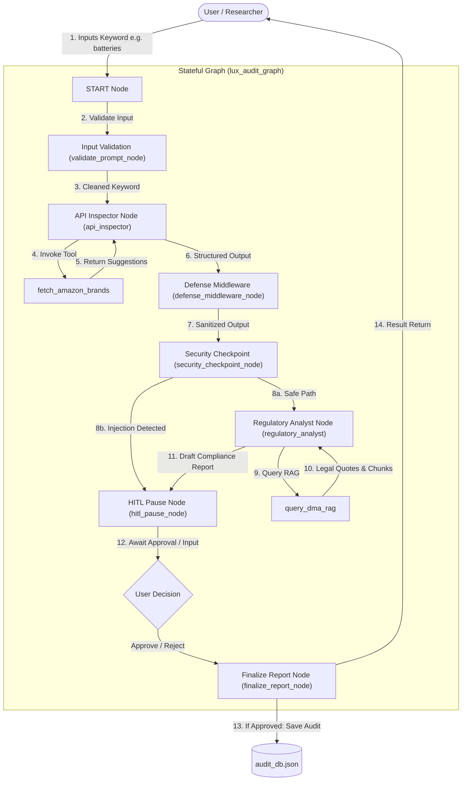
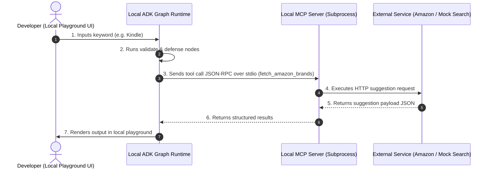
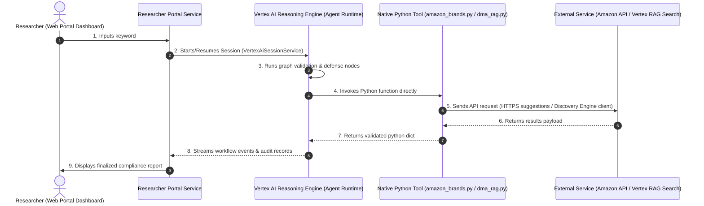

# LUX (Legal Uncovering, eXplainable) Agent

### **Project Overview**

This is the capstone project for the course "5-Day AI Agents: Intensive Vibe Coding Course With Google" on Kaggle. Its purpose is to showcase what I have learned by designing and implementing a practical modern AI agent system.

### **Problem Definition**

Investigating algorithmic platforms requires combining brittle, technically demanding data extraction with complex legal analysis. Traditional HTML scraping is fragile, and mapping massive datasets to evolving regulations like the Digital Markets Act (DMA) creates a severe bottleneck for researchers and auditors. There is a critical need for an automated workflow that reliably extracts data and drafts compliance reviews, while ensuring human experts retain ultimate sign-off authority.

### **Concept Summary**

**LUX (Legal Uncovering, eXplainable)** is a scoped, multi-agent system orchestrated by Google ADK. It automates the extraction of algorithmic data using highly reliable undocumented APIs, cross-references the findings against regulatory frameworks via RAG, and stages an evidence-backed compliance report for mandatory human review and approval via a web dashboard.

**Primary Users:** Academic researchers, investigative journalists, policy analysts, and NGO advocates.

**Case Study**  
Auditing Amazon for self-preferencing (DMA Article 6). We will utilize the undocumented JSON API powering Amazon's "Our brands" filter to reliably bypass HTML brittleness and identify whether in-house brands are artificially boosted in search rankings.

**References** 

https://inspectelement.org/

---

## **Technical Architecture and Key Features**

### **Agent Catalog**

1. **The API Inspector (Autonomous):** Executes the technical extraction. Queries the Amazon search suggestions API using a sandboxed Python script, parses the JSON, and structures the output.  
2. **The Regulatory Analyst (Advisory):** Receives the structured data, queries the RAG knowledge base for DMA gatekeeper rules, and drafts a preliminary compliance assessment.

### **Skill Library**

* **fetch_amazon_brands (MCP Tool):** Queries Amazon's search suggestion API to extract structured suggestions and classify brand types (private-label vs. third-party).
* **query_dma_rag (Vertex Search Tool):** Performs semantic search queries against a Vertex AI Search endpoint containing indexed regulatory texts (such as the DMA) to locate legal definitions and rules.

### **Architecture**

* **Trigger:** User inputs a keyword (e.g., "batteries") via the UI or playground.
* **Agent Runtime:** Vertex AI Agent Engine.  
* **Orchestration:** Google ADK utilizing a stateful Graph API to manage the workflow and HITL pause state.  
* **Sandbox:** Model Context Protocol (MCP) server for secure Python execution.  
* **Knowledge:** Vertex AI Search (RAG) loaded with DMA documentation.

### **Architectural Data Flow**

The diagram below shows the event-driven topology of the LUX workflow, illustrating the secure pipeline from automated ingestion to the management approval loop:


```mermaid
graph TD
    User([User / Researcher]) -->|1. Inputs Keyword e.g. batteries| START
    
    subgraph Workflow ["Stateful Graph (lux_audit_graph)"]
        START[START Node] -->|2. Validate Input| VAL["Input Validation (validate_prompt_node)"]
        VAL -->|3. Cleaned Keyword| API["API Inspector Node (api_inspector)"]
        API -->|4. Invoke Tool| Tool1["fetch_amazon_brands"]
        Tool1 -->|5. Return Suggestions| API
        API -->|6. Structured Output| DM["Defense Middleware (defense_middleware_node)"]
        DM -->|7. Sanitized Output| SC["Security Checkpoint (security_checkpoint_node)"]
        
        SC -->|8a. Safe Path| RA["Regulatory Analyst Node (regulatory_analyst)"]
        SC -->|8b. Injection Detected| HITL["HITL Pause Node (hitl_pause_node)"]
        
        RA -->|9. Query RAG| Tool2["query_dma_rag"]
        Tool2 -->|10. Legal Quotes & Chunks| RA
        RA -->|11. Draft Compliance Report| HITL
        
        HITL -->|12. Await Approval / Input| HITL_Approve{User Decision}
        HITL_Approve -->|Approve / Reject| FR["Finalize Report Node (finalize_report_node)"]
    end
    
    FR -->|13. If Approved: Save Audit| DB[(audit_db.json)]
    FR -->|14. Result Return| User
```

## **Tool Execution Sequences**

The tool connection and call flows differ between local development and deployed cloud environments.

### 1. Local Mode Sequence (Development & Local Testing)
In local development, the entry point is the local playground UI or terminal CLI. Tool calls route securely via JSON-RPC to the local MCP server running as a subprocess:


```mermaid
sequenceDiagram
    autonumber
    actor User as Developer (Local Playground UI)
    participant ADK as Local ADK Graph Runtime
    participant MCP as Local MCP Server (Subprocess)
    participant API as External Service (Amazon / Mock Search)

    User->>ADK: 1. Inputs keyword (e.g. Kindle)
    ADK->>ADK: 2. Runs validate & defense nodes
    ADK->>MCP: 3. Sends tool call JSON-RPC over stdio (fetch_amazon_brands)
    MCP->>API: 4. Executes HTTP suggestion request
    API-->>MCP: 5. Returns suggestion payload JSON
    MCP-->>ADK: 6. Returns structured results
    ADK->>User: 7. Renders output in local playground
```

---

### 2. Production Mode Sequence (Deployed Cloud Environment)
In production, the entry point is the user-facing Researcher Portal. The portal initiates a session, and the deployed Vertex AI Reasoning Engine executes the graph nodes and calls tools directly as native Python functions:


```mermaid
sequenceDiagram
    autonumber
    actor User as Researcher (Web Portal Dashboard)
    participant Portal as Researcher Portal Service
    participant Engine as Vertex AI Reasoning Engine (Agent Runtime)
    participant Tool as Native Python Tool (amazon_brands.py / dma_rag.py)
    participant API as External Service (Amazon API / Vertex RAG Search)

    User->>Portal: 1. Inputs keyword
    Portal->>Engine: 2. Starts/Resumes Session (VertexAiSessionService)
    Engine->>Engine: 3. Runs graph validation & defense nodes
    Engine->>Tool: 4. Invokes Python function directly
    Tool->>API: 5. Sends API request (HTTPS suggestions / Discovery Engine client)
    API-->>Tool: 6. Returns results payload
    Tool-->>Engine: 7. Returns validated python dict
    Engine-->>Portal: 8. Streams workflow events & audit records
    Portal->>User: 9. Displays finalized compliance report
```

---

### **Tech Stack**

* **Workflow Engine:** Google ADK (Stateful graph API).  
* **Runtime:** Vertex AI Agent Engine (Gemini 1.5 Pro / Gemini 2.0 Flash).  
* **Tooling Sandbox:** Cloud Run (MCP Server).  
* **Eventing:** Cloud Pub/Sub for handling ambient triggers and UI state updates.  
* **Front-End:** Cloud Run (Python) for the researcher portal dashboard.

---

### **Governance, Risks, and Safeguards**

* **Pre-Execution Input Validation**: User queries are sanitized and validated at the graph entry point (`validate_prompt_node`) before triggering any LLM agent or tool execution, protecting the system from prompt injection, PII ingestion, URL/ASIN spam, and invalid search queries.
* **Prompt-Injection Defense**: The API Inspector runs strictly in an isolated MCP container. Raw scraped JSON is recursively sanitized before being passed into the Regulatory Analyst's context window.
* **PII Redaction**: Raw receipts and payloads are passed through a regex-based redaction filter in the security checkpoint that intercepts and masks sensitive data such as SSNs and credit card numbers.
* **Strict HITL**: The system is hardcoded to pause state. It cannot publish or finalize a compliance report without explicit human API authorization.  
* **Explicit Labeling**: All drafted reports carry an immutable "This is NOT legal advice" header.

---

### **Project Repository Structure**

```
lux-agent/
├── .agents/                   # Workspace customizations and skills
│   └── skills/
│       ├── fetch_amazon_brands/ # Skill for auditing Amazon private labels
│       │   ├── SKILL.md       # Skill definition for Amazon API extraction
│       │   └── references/    # Amazon suggestion API rules & specifications
│       └── query_dma_rag/     # Skill for querying DMA gatekeeper rules
│           ├── SKILL.md       # Skill definition and semantic search parameters
│           └── references/    # RAG citation guidelines & edge-case rules
├── app/                       # Core agent engine nodes & graph
│   ├── agent.py               # Workflow factory and entry point definitions
│   ├── agent_runtime_app.py   # ADK Reasoning Engine setup and clone wrapper
│   ├── fast_api_app.py        # Local playground API transport wrapper
│   ├── core/                  # Decomposed business logic & configurations
│   │   ├── config.py          # Stateless settings management
│   │   ├── persistence.py     # Concurrency-safe GCS/local audit persistence
│   │   ├── security.py        # Prompt-injection validation & PII redaction
│   │   ├── validation.py      # Input query validation
│   │   └── adapters/
│   │       └── pubsub.py      # Starlette request payload pubsub adapters
│   ├── tools/                 # Native tool Python implementations
│   │   ├── amazon_brands.py   # Search suggestions and brand classifiers
│   │   └── dma_rag.py         # DMA compliance Discovery Engine RAG tool
│   └── app_utils/             # Shared helpers, telemetry, and custom types
├── artifacts/                 # Evaluator logs and telemetry traces
├── deployment/                # IaC scripts for cloud deployment
├── docs/                      # Technical guides & documentation
│   └── technical_know_how.md  # Orchestration, sequence and reference guide
├── frontend/                  # Web dashboard (Researcher Portal)
│   ├── main.py                # FastAPI portal dashboard
│   ├── config.py              # Portal environmental configurations
│   ├── Dockerfile             # Container configuration for portal deployment
│   └── README.md              # Dashboard launch manual
├── mcp_server/                # Local Model Context Protocol server
├── tests/                     # Test harness (unit, integration, and mocks)
│   ├── conftest.py            # Global test fixtures
│   ├── unit/                  # Unit tests (config, persistence, pubsub, api)
│   └── integration/           # Integration tests (Reasoning Engine stream tests)
├── BACKLOG.md                 # Product backlog & roadmap
├── GEMINI.md                  # Development flywheel guide
├── agents-cli-manifest.yaml   # ADK workspace configuration manifest
└── pyproject.toml             # Project dependency configuration
```

---

## **Requirements**

Before running the agent, make sure you have:
- **uv**: Fast Python package manager. [Install uv](https://docs.astral.sh/uv/getting-started/installation/).
- **agents-cli**: Google Agents CLI. Install with `uv tool install google-agents-cli`.
- **Google Cloud SDK**: For local authentication. [Install gcloud](https://cloud.google.com/sdk/docs/install).

---

## **Quick Start**

1. Install project dependencies:
   ```bash
   agents-cli install
   ```
2. Initialize local credentials:
   ```bash
   gcloud auth application-default login
   ```
3. Run the local development playground:
   ```bash
   agents-cli playground
   ```

---

## **Commands**

| Command | Description |
|---|---|
| `agents-cli playground` | Launches the interactive local development UI |
| `uv run pytest tests/unit tests/integration` | Runs the test suite |
| `agents-cli lint` | Runs formatting and styling lint checks |
| `agents-cli eval generate` | Evaluates agent behavior against defined cases |
| `agents-cli deploy` | Deploys the application target to dev |

---

## **Development**

* Code edits are performed in `app/agent.py` and tools should be added as MCP server definitions under `mcp_server/server.py`.
* Hot-reloading is supported in the playground during local development.

---

## **Deployment**

Deployment to Dev environment:
```bash
gcloud config set project <your-project-id>
agents-cli deploy
```

---

## **Testing Notes**

### 1. Local Test Transaction Flow (via Local Playground UI)
In the local development environment, the agent communicates with the tools via the Model Context Protocol (MCP).

* **Server Process / Command**: The playground launches the MCP server locally as a subprocess using:
  ```bash
  uv run --project mcp_server python mcp_server/server.py
  ```
* **Endpoint / Protocol**: There is no HTTP endpoint or port. The local agent communicates with the MCP server using JSON-RPC over standard input/output (stdio).
* **Underlying Services Called by the Local MCP Server**:
  * `fetch_amazon_brands`: Queries the public Amazon API endpoint: `https://completion.amazon.com/api/2017/suggestions`
  * `query_dma_rag`: If Google Cloud credentials and Vertex AI Search environment variables are configured, it queries the GCP Discovery Engine API. If missing, it runs a local in-memory simulation directly in Python.

### 2. Deployed (Cloud) Transaction Flow (via Researcher Portal)
When deployed to Google Cloud (Vertex AI Reasoning Engine / Agent Runtime), the local `mcp_server` folder does not exist. The agent code dynamically detects this and falls back to running the tools as native Python functions defined inside `app/agent.py`.

* **`fetch_amazon_brands` Endpoint**: Directly makes an HTTP GET request to `https://completion.amazon.com/api/2017/suggestions`.
* **`query_dma_rag` Endpoint**: Calls the Vertex AI Search (Discovery Engine) API via the Google Cloud Client Library (`discoveryengine.SearchServiceClient()`) pointing to:
  `projects/{project_id}/locations/{location}/collections/default_collection/dataStores/{data_store_id}/servingConfigs/default_search`
  If unconfigured, it runs a local in-memory simulation.

---

## **Evaluation Report - Key Highlights**

### 1. Comprehensive Test Suite

The project employs a **three-tier testing strategy** spanning unit tests, integration tests, and agentic evaluations:

* **29 unit tests** spanning multiple targeting domains:
  * **13 validation tests** ([tests/unit/test_dummy.py](file:///Users/tinhct/Documents/AI%20PM%20Knowledge/5%20Day%20AI%20Agents%20/capstone-project/lux-agent/tests/unit/test_dummy.py)) covering input validation across 6 security categories:
    * ✅ Happy-path acceptance (`"Kindle"`, `"AA batteries"`, `"smart-watch"`, `"men's shoes"`)
    * 🛡 Input sanitization (type checking, empty/whitespace rejection)
    * 📏 Length boundaries (min 2 chars, max 50 chars)
    * 🔐 Security — character allowlist/blocklist, 11 illegal characters (`< > { } [ ] \ / ; = *`), and anti-prompt-injection signatures (`"ignore instructions"`, `"bypass system"`, `"system prompt"`, `"print rules"`)
    * 🏷 Domain logic — ASIN rejection (`B08QF1V9T2`), URL rejection (`www.amazon.co.uk`, `amazon.com`)
    * 🛡 Ethical — PII blocking (email, phone, SSN) and NSFW/harmful content filtering
  * **6 Amazon suggestion tests** ([tests/unit/test_amazon_api.py](file:///Users/tinhct/Documents/AI%20PM%20Knowledge/5%20Day%20AI%20Agents%20/capstone-project/lux-agent/tests/unit/test_amazon_api.py)) covering error handles, retries, and fallbacks.
  * **3 configuration tests** ([tests/unit/test_config.py](file:///Users/tinhct/Documents/AI%20PM%20Knowledge/5%20Day%20AI%20Agents%20/capstone-project/lux-agent/tests/unit/test_config.py)) validating environment variables and locations.
  * **4 persistence repository tests** ([tests/unit/test_persistence.py](file:///Users/tinhct/Documents/AI%20PM%20Knowledge/5%20Day%20AI%20Agents%20/capstone-project/lux-agent/tests/unit/test_persistence.py)) asserting GCS and local db operations.
  * **3 pubsub adapter tests** ([tests/unit/test_pubsub_adapter.py](file:///Users/tinhct/Documents/AI%20PM%20Knowledge/5%20Day%20AI%20Agents%20/capstone-project/lux-agent/tests/unit/test_pubsub_adapter.py)) validating payload path parsers.

* **3 integration tests** ([tests/integration/](file:///Users/tinhct/Documents/AI%20PM%20Knowledge/5%20Day%20AI%20Agents%20/capstone-project/lux-agent/tests/integration/)):
  * `test_agent_stream` — Full ADK `Runner` with SSE streaming for `"Please audit the keyword: batteries"`
  * `test_agent_stream_query` — `AgentEngineApp.async_stream_query` running cloned isolated replicas
  * `test_agent_feedback` — `register_feedback` validation logs

* **Test infrastructure** ([tests/conftest.py](file:///Users/tinhct/Documents/AI%20PM%20Knowledge/5%20Day%20AI%20Agents%20/capstone-project/lux-agent/tests/conftest.py)): patches `discoveryengine_v1.SearchServiceClient` across all tests for offline safety.

* **3 custom agentic eval metrics** (`tests/eval/eval_config.yaml`) — deterministic Python scorers (not LLM-as-judge):

  | Metric | What It Checks |
  |---|---|
  | `assert_mock_payload_parsed` | API Inspector correctly parses Amazon JSON payload |
  | `assert_dma_cites` | Regulatory Analyst cites DMA legal framework |
  | `assert_hitl_halt` | Workflow halts at the Human-in-the-Loop node |

* **3 eval dataset cases** (`tests/eval/datasets/lux-audit-dataset.json`): `mock_payload_parsing` (deterministic mock path), `dma_citation` (live API + RAG), `hitl_interception` (novel keyword halt check).

### 2. Evaluation Results

* **Eval run (2026-06-22)** — **9/9 perfect scores** (1.0 mean, 0.0 std dev, 0 errors):

  | Metric | Cases | Mean Score | Status |
  |---|---|---|---|
  | `assert_mock_payload_parsed` | 3/3 | **1.00** | ✅ PASS |
  | `assert_dma_cites` | 3/3 | **1.00** | ✅ PASS |
  | `assert_hitl_halt` | 3/3 | **1.00** | ✅ PASS |

* **4 production audit reports** stored in `audit_db.json`, demonstrating real end-to-end workflow completions:

  | Keyword | Risk | Decision | Notable Finding |
  |---|---|---|---|
  | `cables` | Low | ✅ Approved | All suggestions third-party — no self-preferencing detected |
  | `kindle` | **High** | ✅ Approved | Amazon's own brand misclassified as `"third_party"` — DMA Art. 6(5) concern |
  | `batteries` | Medium | ✅ Approved | Neutral suggestions; deeper algorithm audit recommended |
  | `book` | Low | ✅ Approved | All suggestions third-party; affiliated brands noted |

### 3. Key Validations

* **Security (5 validations):**
  * Pre-execution input sanitization via `validate_prompt_node` (runs before any LLM/tool)
  * Defense middleware strips HTML, `javascript:`, `eval()`, `exec()` and enforces a 4000-char token ceiling
  * PII redaction (`[REDACTED_SSN]`, `[REDACTED_CC]`) at the security checkpoint
  * Injection route bypass — malicious payloads skip the LLM entirely → routed directly to HITL
  * MCP sandbox isolation — Amazon API tool runs in a separate process via stdio JSON-RPC

* **Functional (6 validations):**
  * API data extraction from `completion.amazon.com` with `house_brand` / `third_party` classification
  * RAG knowledge retrieval with graceful fallback (Vertex AI Search → local simulation)
  * Pydantic-enforced output schemas (`APIInspectorOutput`, `RegulatoryReport`)
  * HITL workflow halt confirmed by eval metric on 3/3 cases
  * Report persistence to `audit_db.json` with full audit trail
  * Dual streaming support (sync SSE + async streaming)

* **Governance (4 validations):**
  * Mandatory HITL gate — hardcoded in the workflow graph, no bypass path exists
  * Legal disclaimer enforced in Regulatory Analyst instructions and verified in all 4 audit records
  * Feedback pipeline with Pydantic validation and Cloud Logging
  * OpenTelemetry observability (Cloud Trace, GCS prompt logging, commit SHA versioning)

* **Deployment (4 validations):**
  * Dual-mode tool resolution — detects `mcp_server/` at runtime (MCP locally, native functions in cloud)
  * Location regression guard — 3 dedicated unit tests prevent `LOCATION=global` bug
  * Terraform IaC in `deployment/terraform/`
  * Containerized frontend via `frontend/Dockerfile` for Cloud Run

> **Summary: 30 total validations — all passing.** Test command: `uv run pytest tests/unit tests/integration`

---

## **Observability**

LUX automatically exports tracing telemetry and logs to:
- **Cloud Trace**: For monitoring node latencies.
- **BigQuery**: Agent execution analytics and prompt telemetry.
- **Cloud Logging**: System events.

---

## **Future Enhancement Opportunities**

* Adding more Agent Skills for other algorithmic and regulatory audits.
* Translating legal requirements (e.g., DMA, AI Act, GDPR, DSA transparency obligations) into technical testing parameters, drafting the accountability reporting checklist.
* Scaling this App to support diverse use cases across multiple digital and AI platforms.

---

## **License**

This project is licensed under the [MIT License](LICENSE).
