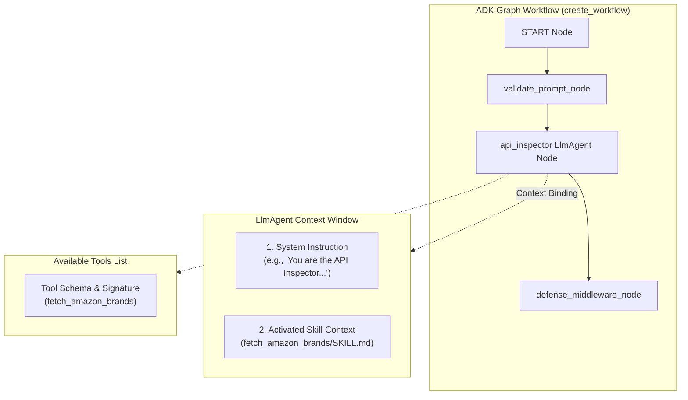
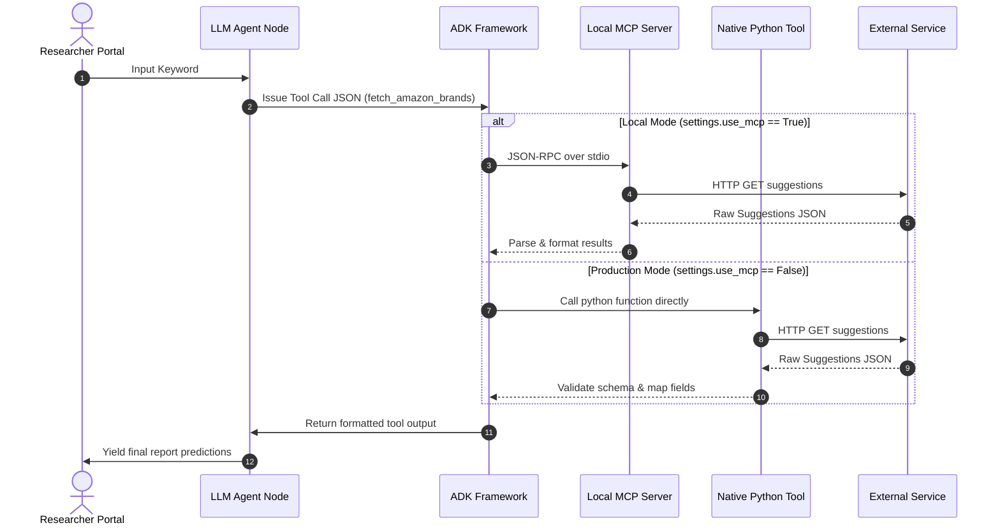

# Technical Know-How: Agent Nodes & Skills Orchestration

This guide describes the technical connection, execution routing, and architectural data flows between **Agent Nodes** and **Skills (Tools)** within the LUX workflow.

---

## 1. Architectural Concepts

In the Google ADK (Agent Development Kit) framework, the workflow is defined as a directed graph where work is distributed between code-based nodes and model-based agents:

*   **Workflow Node (`@node`)**: A stateless Python function that mutates state or routes control flow (e.g., input validation, security screening).
*   **LLM Agent Node (`LlmAgent`)**: A model-driven node (Gemini) that receives system instructions and uses natural language reasoning to solve a task.
*   **Agent Skill/Tool (`McpTool` / native function)**: Extends the capabilities of an LLM agent by allowing it to execute deterministic actions (e.g., calling APIs, querying databases, running semantic search).

---

## 2. Structural Binding Diagram

The following diagram illustrates how the workflow, LLM agents, and skills are bounded together at runtime:

---

## 3. Tool Execution Sequence (Local vs. Cloud)

When the Gemini model decides to execute a skill, the framework routes the call dynamically based on the active profile:

---

## 4. Key Architectural Connection Points

### A. Context Injection
When the graph executes an `LlmAgent` node:
1. The framework reads the agent's core `instruction`.
2. It fetches instructions from the configured `.agents/skills/<skill_name>/SKILL.md` file.
3. It merges these instructions and appends them to the system prompt of the Gemini model. This ensures the model understands **when** and **how** to invoke the corresponding tool.

### B. Tool Schema Binding
During workflow setup (inside `create_workflow(settings)` in [app/agent.py](file:///Users/tinhct/Documents/AI%20PM%20Knowledge/5%20Day%20AI%20Agents%20/capstone-project/lux-agent/app/agent.py)):
*   If `settings.use_mcp` is active, the agent is bound to `McpToolset`. The tool signatures are discovered dynamically from the MCP server.
*   If `use_mcp` is inactive, the agent is bound to standard Python functions (`fetch_amazon_brands`, `query_dma_rag`). The Python function's docstring and type hints serve as the tool schema exposed to Gemini.

### C. Output Sanitization & Schema Validation
All tool executions return structured outputs matching Pydantic schemas (e.g. `APIInspectorOutput` or `RegulatoryReport`). The output is validated by the system before passing to the next node in the graph, preventing downstream processing of corrupt data.
