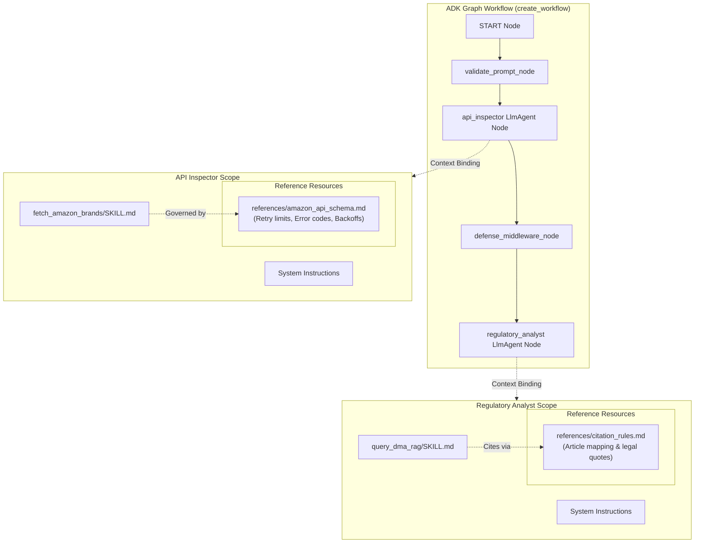
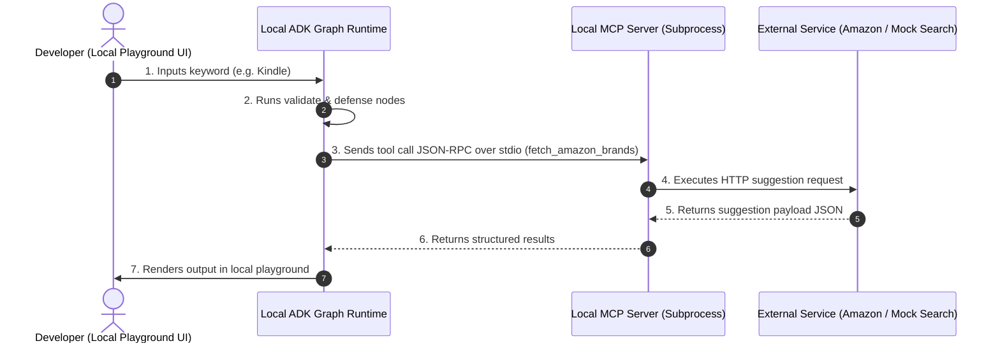
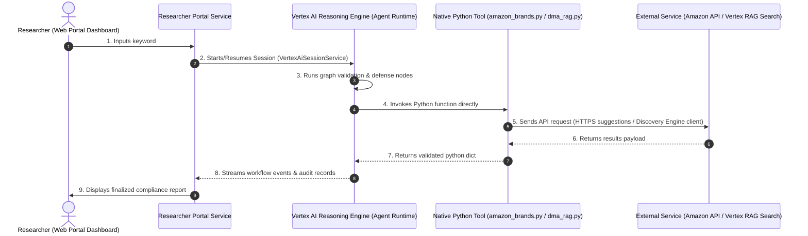

# Technical Know-How: Agent Nodes & Skills Orchestration

This guide describes the technical connection, reference resources, execution routing, and architectural data flows between **Agent Nodes** and **Skills (Tools)** within the LUX workflow.

---

## 1. Architectural Concepts

In the Google ADK (Agent Development Kit) framework, the workflow is defined as a directed graph where work is distributed between code-based nodes, model-based agents, and local/remote reference files:

*   **Workflow Node (`@node`)**: A stateless Python function that mutates state or routes control flow (e.g., input validation, security screening).
*   **LLM Agent Node (`LlmAgent`)**: A model-driven node (Gemini) that receives system instructions and uses natural language reasoning to solve a task.
*   **Agent Skill/Tool (`McpTool` / native function)**: Extends the capabilities of an LLM agent by allowing it to execute deterministic actions (e.g., calling APIs, querying databases, running semantic search).
*   **Reference Resources (`references/`)**: Markdown guides, JSON schemas, or text corpora packaged within the skills folder. They serve as authoritative sources of truth for compliance checks, API schemas, and citation standards.

---

## 2. Structural Binding & Reference Resource Diagram

The following diagram illustrates how the workflow, LLM agents, tools, and their respective reference resources are bound together at runtime:

---

## 3. Tool Execution Sequences

### A. Local Mode Sequence (Development & Local Testing)
In local development, the entry point is the local playground UI or terminal CLI. Tool calls route securely via JSON-RPC to the local MCP server running as a subprocess:

### B. Production Mode Sequence (Deployed Cloud Environment)
In production, the entry point is the user-facing Researcher Portal. The portal initiates a session, and the deployed Vertex AI Reasoning Engine executes the graph nodes and calls tools directly as native Python functions:

---

## 4. Key Architectural Connection Points

### A. Context Injection
When the graph executes an `LlmAgent` node:
1. The framework reads the agent's core `instruction`.
2. It fetches instructions from the configured `.agents/skills/<skill_name>/SKILL.md` file.
3. It merges these instructions and appends them to the system prompt of the Gemini model. This ensures the model understands **when** and **how** to invoke the corresponding tool.

### B. Tool Schema Binding
During workflow setup (inside `create_workflow(settings)` in [app/agent.py](file:///Users/tinhct/Documents/AI%20PM%20Knowledge/5%20Day%20AI%20Agents%20/capstone-project/lux-agent/app/agent.py)):
*   If `settings.use_mcp` is active, the agent is bound to `McpToolset`. The tool signatures are discovered dynamically from the MCP server.
*   If `use_mcp` is inactive, the agent is bound to standard Python functions (`fetch_amazon_brands`, `query_dma_rag`). The Python function's docstring and type hints serve as the tool schema exposed to Gemini.

### C. Reference Resource Integration
Reference resources play two distinct roles in the connection lifecycle:
*   **Static Reference (Design time / Agent System Instructions)**: 
    *   Files like `references/amazon_api_schema.md` define exact compliance schemas (e.g., retries on 429 backoffs, authentication cookies cleansing). The tool code (`amazon_brands.py`) imports and implements these rules deterministically.
*   **Dynamic Reference (Runtime Context)**:
    *   Files inside the RAG `references/` directory govern how the `regulatory_analyst_node` outputs its results. The model reads the legal citation guidelines at execution time to format direct quotes and append the required legal disclaimers.
